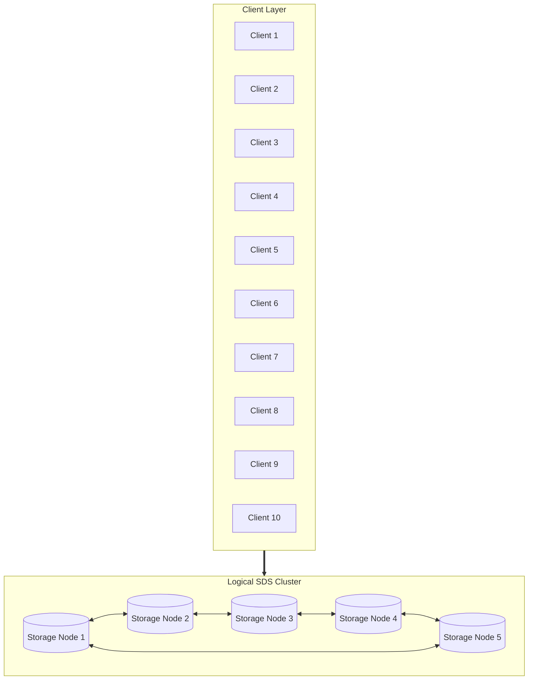

# template

```mermaid

graph TD
    subgraph Clients [Client Layer]
        C1[Client 1]
        C2[Client 2]
        C3[Client 3]
        C4[Client 4]
        C5[Client 5]
        C6[Client 6]
        C7[Client 7]
        C8[Client 8]
        C9[Client 9]
        C10[Client 10]
    end

    subgraph SDS_Cluster [Logical SDS Cluster]
        direction LR
        S1[(Storage Node 1)]
        S2[(Storage Node 2)]
        S3[(Storage Node 3)]
        S4[(Storage Node 4)]
        S5[(Storage Node 5)]
        
        %% Inter-node communication for replication/quorum
        S1 <--> S2
        S2 <--> S3
        S3 <--> S4
        S4 <--> S5
        S5 <--> S1
    end

    %% Connections from clients to the cluster
    Clients ==> SDS_Cluster

``` 
