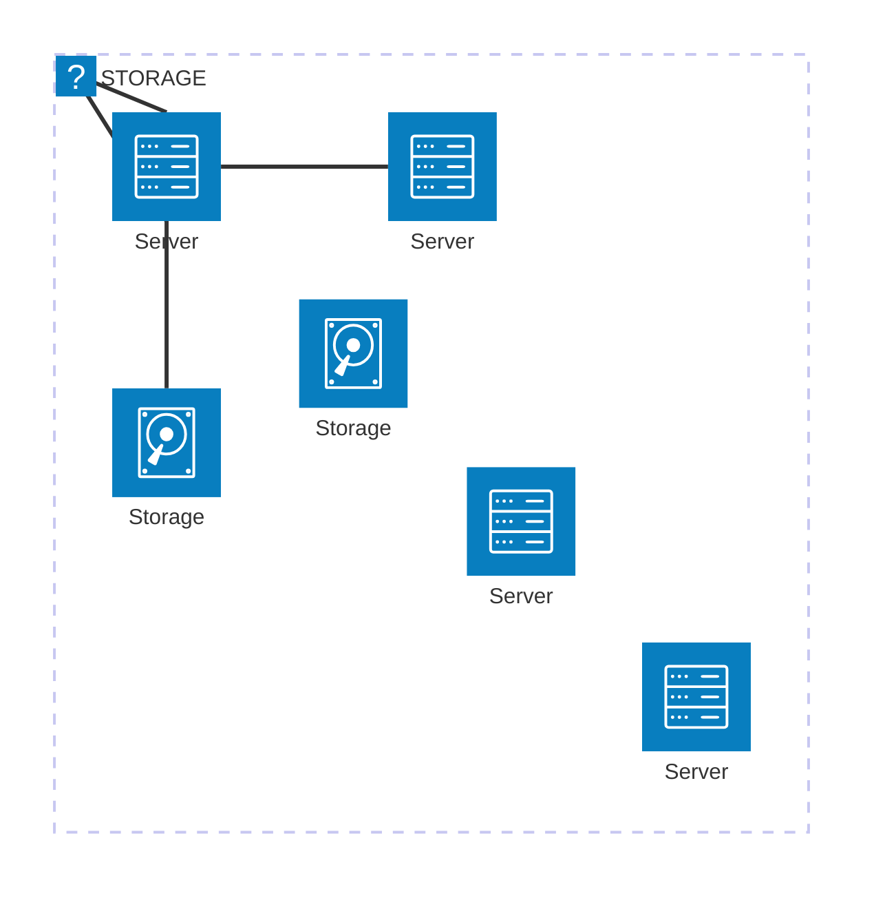

# Architecture diagram

```mermaid
architecture-beta
    group storage(storage)[STORAGE]

    service server1(server)[Server] in storage
    service server2(server)[Server] in storage
    service server3(server)[Server] in storage
    service server4(server)[Server] in storage
    service disk1(disk)[Storage] in storage
    service disk2(disk)[Storage] in storage

    server1:L -- R:server2
    server2:T -- B:server2
    disk2:T -- B:server2

```

### Resources:
https://mermaid.js.org/syntax/architecture.html
