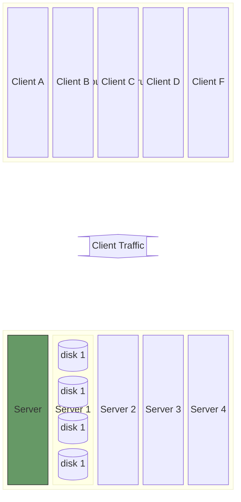

# A widely known storage product

```mermaid
block
columns 1
  block:Compute["Compute infrastructure"]
    C1["Client A"]
    C2["Client B"]
    C3["Client C"]
    C4["Client D"]
    C5["Client E"]
    C5["Client F"]
  end
  clientTraffic<["Client Traffic"]>(y)
  block:Storage
    Server block:S1["Server 1"]
    columns 1
      disk1[("disk 1")]
      disk2[("disk 1")]
      disk3[("disk 1")]
      disk4[("disk 1")]
    end
    S2["Server 2"]
    S3["Server 3"]
    S4["Server 4"]
  end

classDef server fill:#696,stroke:#333;
classDef client fill:#966,stroke:#333;

class Server server

```

