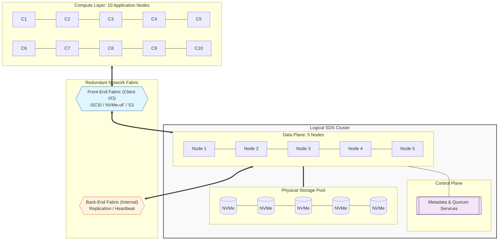

# template

```mermaid
graph TB
    subgraph Clients [Compute Layer: 10 Application Nodes]
        C1[C1] --- C2[C2] --- C3[C3] --- C4[C4] --- C5[C5]
        C6[C6] --- C7[C7] --- C8[C8] --- C9[C9] --- C10[C10]
    end

    subgraph Fabric [Redundant Network Fabric]
        direction LR
        FE_Net{{"Front-End Fabric (Client I/O)<br/>iSCSI / NVMe-oF / S3"}} 
        BE_Net{{"Back-End Fabric (Internal)<br/>Replication / Heartbeat"}}
    end

    subgraph SDS_Cluster [Logical SDS Cluster]
        direction TB
        
        subgraph Meta [Control Plane]
            Consensus[[Metadata & Quorum Services]]
        end

        subgraph StorageNodes [Data Plane: 5 Nodes]
            direction LR
            S1[Node 1] --- S2[Node 2] --- S3[Node 3] --- S4[Node 4] --- S5[Node 5]
        end

        subgraph Disks [Physical Storage Pool]
            D1[(NVMe)] --- D2[(NVMe)] --- D3[(NVMe)] --- D4[(NVMe)] --- D5[(NVMe)]
        end
    end

    %% Connectivity
    Clients <==> FE_Net
    FE_Net <==> StorageNodes
    StorageNodes <==> BE_Net
    StorageNodes --- Consensus
    StorageNodes === Disks

    %% Styling
    style SDS_Cluster fill:#f9f9f9,stroke:#333,stroke-width:2px
    style FE_Net fill:#e1f5fe,stroke:#01579b
    style BE_Net fill:#fff3e0,stroke:#e65100
    style Consensus fill:#f3e5f5,stroke:#4a148c


``` 
